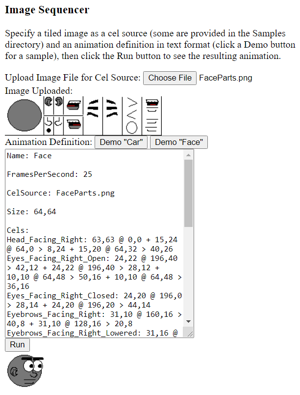

ImageSequencer
==============

A framework for making rudimentary animations by displaying frames taken from a larger image in sequence.

To see it in action, open /Source/ImageSequencer.html in a web browser that runs JavaScript.

